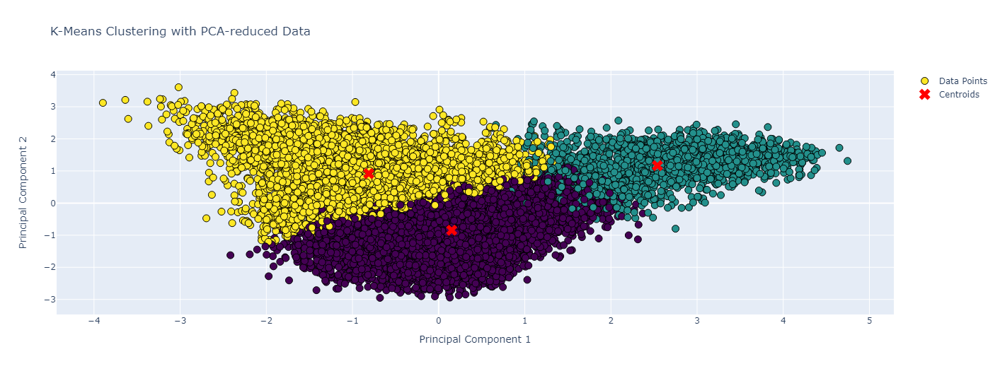
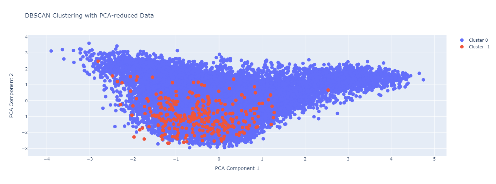
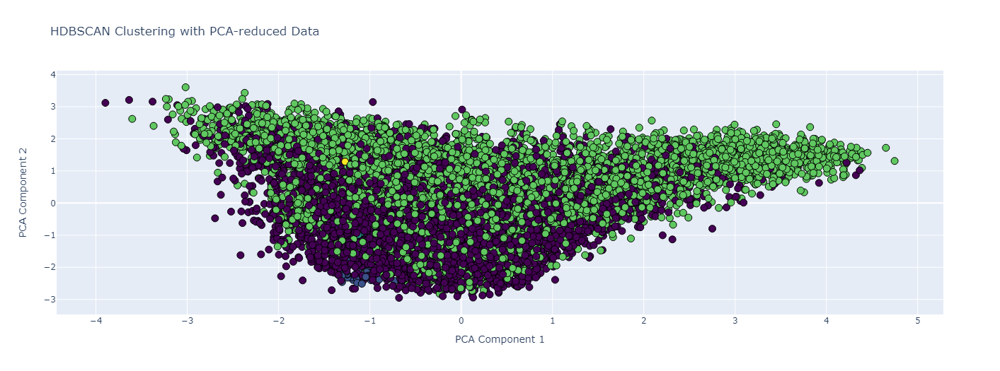

# Data Clustering and Analysis - 2024 Internship Coding Challenge 📊

This repository contains my submission for the 2024 Internship Coding Challenge. It consists of a comprehensive Jupyter notebook that explores data clustering techniques and their performance analysis.

## Sections in the Notebook

- **Data Exploration**: Initial examination of the dataset to understand its characteristics and distribution.
- **Clustering Algorithms**: Implementation and comparison of different clustering methods.
- **Performance Analysis**: Evaluation of each algorithm based on the clustering results.
- **Future Scope**: Discussion on potential improvements and future research directions.
- **References**: Citing all the resources and literature used in this analysis.

### Data Exploration 🕵️‍♂️

**Observations**:

- The principal component analysis reveals a significant variance along the first component, suggesting a primary axis of data spread.
- The continuous scatter of data points indicates that traditional clustering might face challenges in distinctly grouping the data.

### Clustering Algorithms 🧮

1. **K-Means**: Determination of the optimal number of clusters using the elbow method.
   
   
3. **DBSCAN**: Density-based spatial clustering of applications with noise.
   
   
5. **HDBSCAN**: Hierarchical density-based clustering.
   

Each algorithm is briefly described and utilized to find patterns within the data.

### Performance Analysis and Conclusion 🔍

- **K-Means Clustering**: Effective if data structures have compact and distinct groupings.
- **DBSCAN Clustering**: Capable of identifying dense regions and distinguishing outliers, providing insights into the noise within the dataset.
- **HDBSCAN Clustering**: Offers a robust identification of clusters with varying densities, potentially aligning well with complex data distributions.

**Conclusions**:

- HDBSCAN's performance is promising for data with non-spherical clusters or varying densities.
- DBSCAN's distinction between the main cluster and outliers could be crucial if the noise is a significant factor.
- The simplicity of K-Means might be beneficial if the data contains well-separated categories.

### Future Scope 🚀

- **Feature Extraction**: Leverage GPT and BERT for generating deep semantic embeddings to enhance clustering inputs.
- **Parameter Tuning**: Refine DBSCAN and HDBSCAN settings to optimize clustering outputs.
- **Feature Analysis**: Delve into the driving forces behind cluster formations and explore feature engineering opportunities.
- **Dimensionality Reduction**: Investigate alternative methods beyond PCA for revealing data structures.
- **Ensemble Methods**: Combine multiple clustering algorithms for a consensus approach to mitigate individual limitations.
- **Domain-Specific Insights**: Engage with experts to validate and interpret clustering results in the context of domain knowledge.
- **Predictive Modeling**: Utilize clusters as features in predictive models to assess their contribution to model performance.
- **Scalability and Efficiency**: Address the scalability of algorithms for larger datasets and improve computational efficiency.


### Running the Notebook 🏃‍♀️

To run the Jupyter notebook and visualize the results with Plotly, load the dataset using the following command within the notebook by add ading dataset path:

```python
dataset = pd.read_parquet("/content/drive/MyDrive/dataset.parquet")
```

Please ensure the dataset file path is correct and accessible.

### References 📚

- *Saji, B. (2024) Elbow method for finding the optimal number of clusters in K-means, Analytics Vidhya. Available at: https://www.analyticsvidhya.com/blog/2021/01/in-depth-intuition-of-k-means-clustering-algorithm-in-machine-learning/#:~:text=The%20elbow%20method%20is%20a%20technique%20used%20in%20clustering%20analysis,WCSS%20starts%20to%20level%20off. (Accessed: 28 January 2024).*
- *Dorji, N. (2018) DBSCAN: Density-based Clustering Essentials, Datanovia. Available at: https://www.datanovia.com/en/lessons/dbscan-density-based-clustering-essentials/ (Accessed: 28 January 2024).* 
- *Sklearn.cluster.HDBSCAN (no date) scikit. Available at: https://scikit-learn.org/stable/modules/generated/sklearn.cluster.HDBSCAN.html (Accessed: 28 January 2024).*
- *St&ouml;ckl, A. (2021) Clustering the 20 newsgroups dataset with GPT3 embeddings, Medium. Available at: https://towardsdatascience.com/clustering-the-20-newsgroups-dataset-with-gpt3-embeddings-10411a9ad150 (Accessed: 28 January 2024).*
- *Ghantasala, P., Nayani, S.S. and Lita Doolan MRSB AMBCS Oxford Biologist Harvard Educated AI Technician (2023) How do you optimize clustering models?, How to Optimize Your Clustering Models for Data Analysis. Available at: https://www.linkedin.com/advice/3/how-do-you-optimize-clustering-models-skills-data-analysis (Accessed: 28 January 2024).*
- *Plotly (no date) Plotly/plotly.py: The Interactive Graphing Library for Python this project now includes Plotly Express!, GitHub. Available at: https://github.com/plotly/plotly.py (Accessed: 28 January 2024).*
